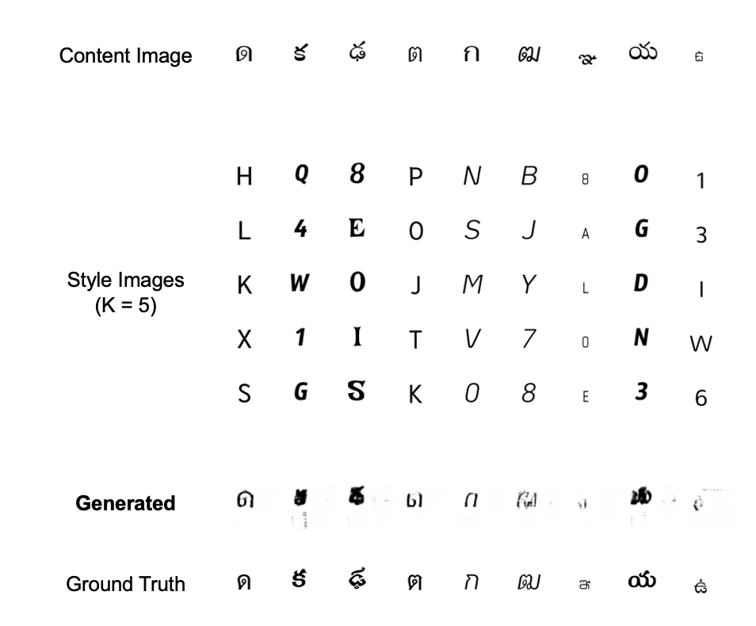
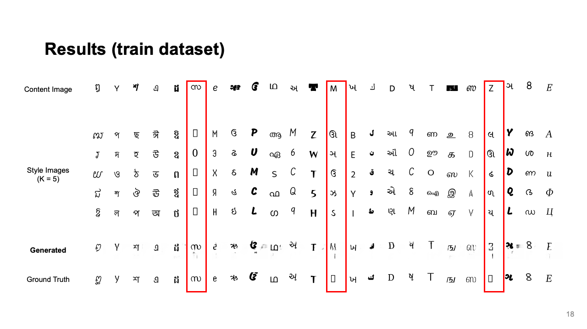

# Font Style Transfer across multiple languages

This is an unofficial implementation for the paper [Few-shot Font Style Transfer between Different Languages](https://openaccess.thecvf.com/content/WACV2021/papers/Li_Few-Shot_Font_Style_Transfer_Between_Different_Languages_WACV_2021_paper.pdf). The original implementation from the author can be found [here](https://github.com/ligoudaner377/font_translator_gan).

## Setup

### Requirements

See [requirements.txt](./requirements.txt)

### Checkpoints

Download pretrained checkpoints for the evaluation to [`pretrained`](./pretrained/) directory.

- [ftgan_vanilla_best.ckpt](https://drive.google.com/file/d/1Gex2gYt1EYtSDckldgB0F5sqJs2XPpl4/view?usp=share_link)
- [google_font_best.ckpt](https://drive.google.com/file/d/1BE-W1qnscGnuMN5yNRADVJl-qB0NmucB/view?usp=share_link)

### Data

For FTransGAN original data, you can download at [the official repository](https://github.com/ligoudaner377/font_translator_gan).

For our multilingual dataset, you can download at [our google drive link](https://drive.google.com/file/d/1VAeBmoAF__LIIvte-megsNGN5DzexY0_/view?usp=share_link).

Please locate in [`data/ftgan-fonts`](./data) and [`data/google-fonts`](./data) for each. 

## Cheatsheet

### Train

```!bash
python trainer.py
```

### Evaluation

For the result of FTrasnGAN and its data,

```!bash
bash evaluate-ftgan.sh
```

The default option is with `test_unknown_content`. You can change it in [`config/datasets/ftgan.yaml`](./config/datasets/ftgan.yaml) by switching the value from `True` to `False`. (If `False`, it evaluates with `test_unknown_style`.)

For the result of Google Fonts data,

```!bash
bash evaluate-google-font.sh
```

## Updates

`2022.12.04`

This code is a part of my final term project in _Special Topics in Computer Science - Introduction to Deep Learning (CS492I)_ (2022 Fall, KAIST).  
The goal of my proposal is to generate novel fonts for a certain language, whose style is transferred from fonts for other languages.  
In this project, I used [google/font](https://github.com/google/fonts) repository to define [Google Fonts](https://fonts.google.com/) dataset, which contains font images from 10 different languages.  

However, I failed to introduce the font generation models for unseen languages. Instead, I'll share some results in training dataset to explain the core concept of this project.

Hope that I could finish this project successfully in some days :)

## Main concept




## To be continued...

- [x] finish the military service in South Korea
- [ ] finish the undergraduate course and (might) go to graduate school...
